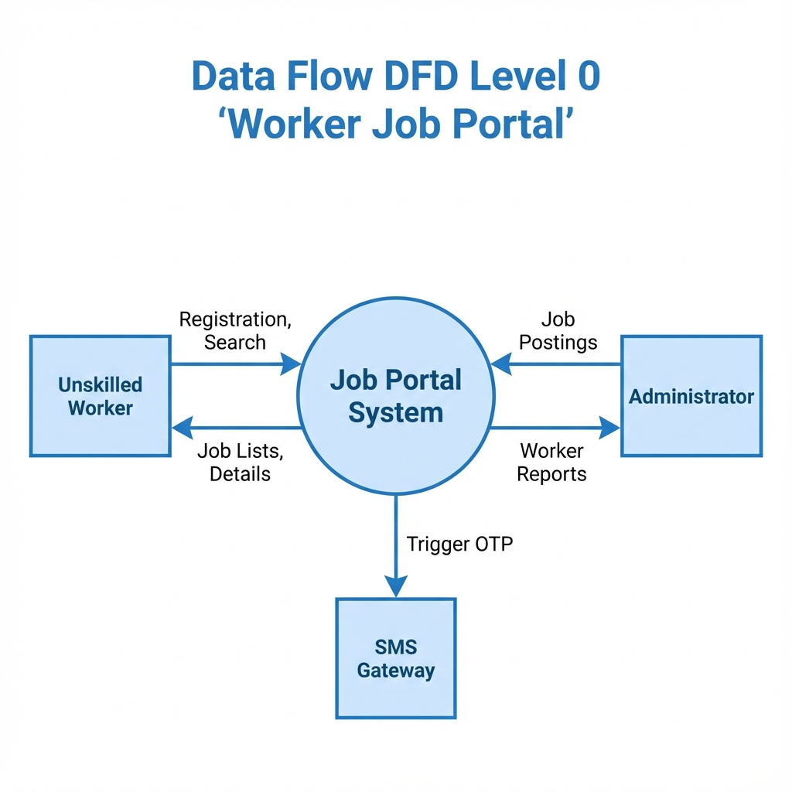
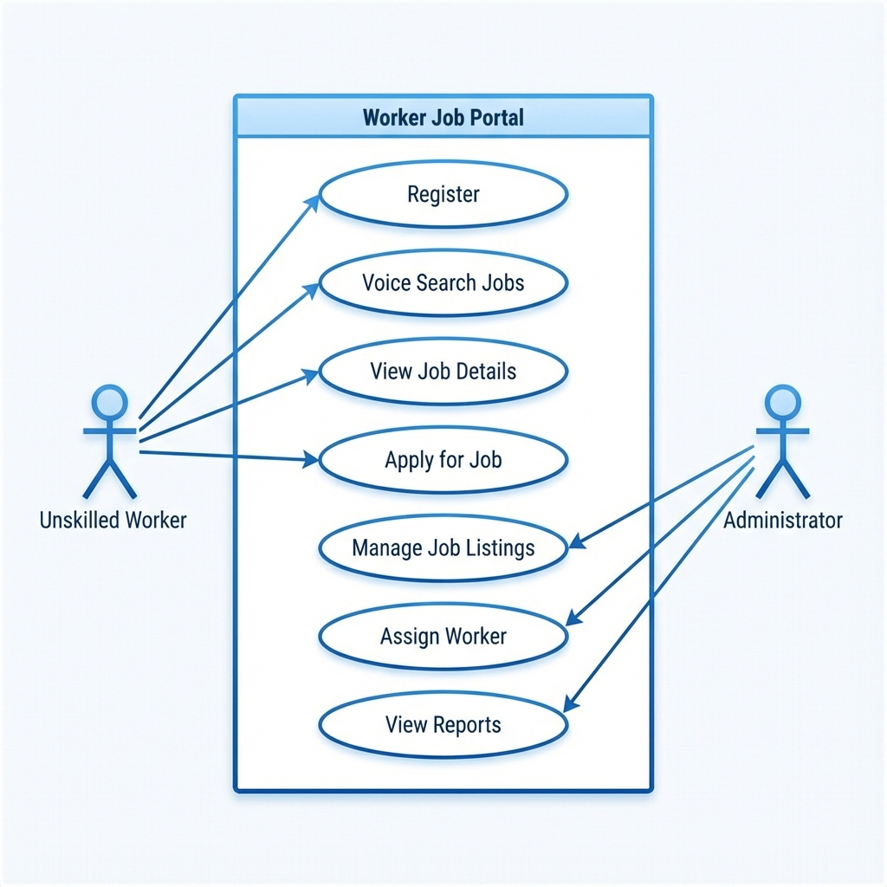
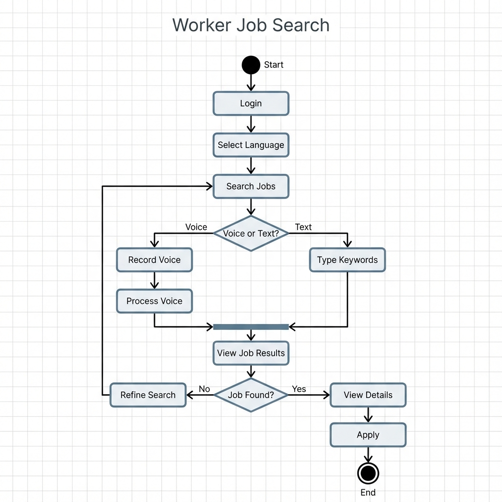

# AI Job Seeking Portal 🚀

A modern, full-stack web application designed to bridge the gap between unskilled workers and employment opportunities. This platform streamlines worker registration, job posting, and recruitment management with a focus on accessibility and real-time connectivity.

## 🌟 Key Features

-   🌍 **Multi-language Support**: Fully integrated support for **Tamil** and **English**, ensuring accessibility for manual labor workforces.
-   📊 **Comprehensive Admin Dashboard**: Centralized hub for administrators to post job vacancies, verify worker profiles, and manage assignments.
-   📱 **Real-time Notifications**: Integrated SMS/OTP flow for secure login and instant job alerts.
-   📍 **Geo-location Integration**: Uses browser Geolocation APIs to match workers with job sites based on proximity.
-   🎤 **Voice Search Ready**: Built-in capabilities (or ready-to-expand) for voice-based job queries, catering to varying literacy levels.

## 🛠️ Tech Stack

-   **Frontend**: [Next.js](https://nextjs.org/) (App Router), React, Tailwind CSS
-   **Backend**: Node.js (Serverless API routes)
-   **Database**: MongoDB Atlas (NoSQL)
-   **Authentication**: Custom OTP-based verification
-   **Deployment**: Optimized for Vercel

## 🏗️ System Architecture

### Context Diagram (System Overview)


### Database Design (ER Diagram)
 
*(Note: Using Use Case Diagram here as a placeholder for visual flow; verify specific ER diagram availability)*

### Activity Flow


---

## 🚀 Getting Started

First, install dependencies:

```bash
npm install
```

Then, run the development server:

```bash
npm run dev
```

Open [http://localhost:3000](http://localhost:3000) with your browser to see the result.

## 📖 Documentation

For detailed technical analysis, refer to:
- [Hardware and Software Requirements](HARDWARE_AND_SOFTWARE_REQUIREMENTS.md)
- [System Design Report](REPORT_SYSTEM_DESIGN.md)
- [Tools and Technologies](TOOLS_AND_TECHNOLOGIES.md)

---

Developed with a focus on social impact and technical scalability.
