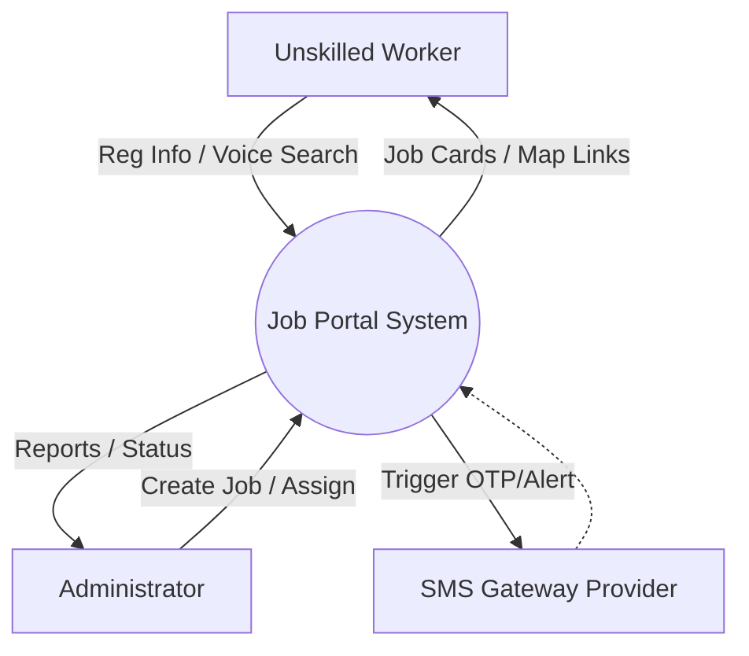
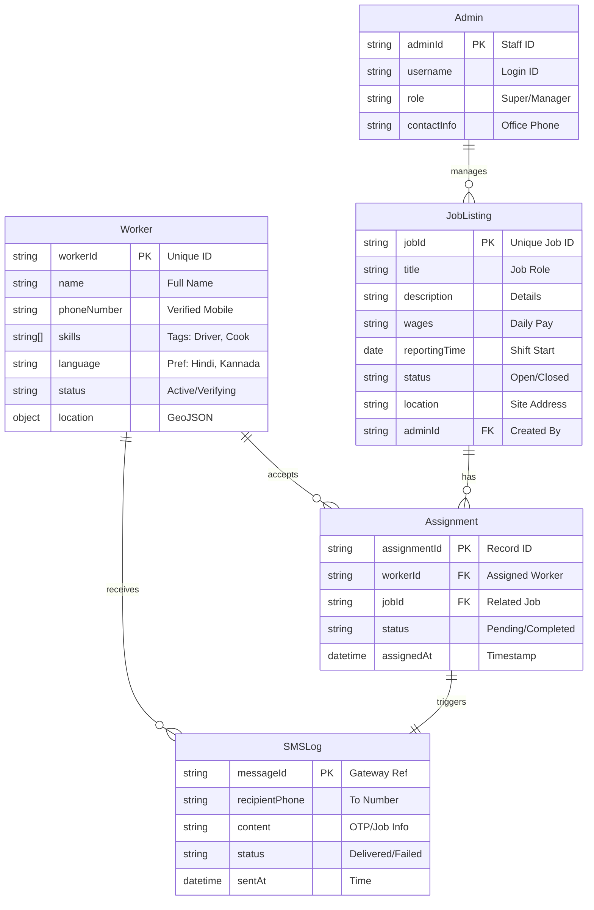

# 4. System Design (High Level / Architectural Design)

## 4.1 System Perspective

The Job Portal is engineered as a centralized web-based ecosystem designed to streamline the interaction between the manual labor workforce and recruitment administrators. Rather than functioning as a standalone tool, it operates as a sophisticated **Client-Server application** leveraging modern **Serverless** architecture to ensure high availability and scalability.

From an architectural standpoint, the system is divided into distinct operational layers that interact with users, cloud services, and external networks:

1.  **The Client-Side Interface (Presentation Layer)**:
    *   This layer represents the visual touchpoint for all users, accessed primarily via web browsers on mobile devices and desktops.
    *   Built using **React**, it is responsible for rendering the dynamic user interface, capturing innovative inputs like voice commands, and managing session-specific data such as language selection.
    *   It maintains a secure channel with the server, exchanging data via optimized RESTful APIs over HTTPS.

2.  **The Server-Side Engine (Logic Layer)**:
    *   Deployed on a serverless Node.js environment (Vercel), this layer executes the core business rules of the platform.
    *   It handles critical operations such as verifying user credentials, processing job search queries, and executing the complex logic required to map workers to appropriate job sites.
    *   It serves as a security buffer, validating and sanitizing all incoming requests to protect the integrity of the database.

3.  **The Database Management System (Data Layer)**:
    *   The system utilizes **MongoDB Atlas**, a scalable cloud-hosted NoSQL database, for persistent data storage.
    *   This design promotes a stateless server architecture, where the server processes requests without retaining user state, relying instead on the database for continuity.
    *   It securely archives essential entities including User Registrations, Job Vacancies, Assignment Histories, and Administrative Records.

4.  **Third-Party Service Integrations**:
    *   **Communication Gateway**: The platform integrates with external SMS services to handle outbound messaging (OTPs and alerts), decoupling notification delivery from core application logic.
    *   **Location Services**: It leverages native browser Geolocation APIs to capture precise coordinates, facilitating location-based services for workers and job sites.

This architectural perspective ensures a **loosely coupled** system design. Components such as the frontend interface or the backend database can be independently updated, scaled, or debugged without causing systemic downtime, ensuring a robust and reliable user experience.

---

## 4.2 Context Diagram (Level 0 DFD)

The Context Diagram (also known as a Level 0 Data Flow Diagram) provides a "helicopter view" of the entire system, showing the system as a single black box and its interaction with external entities.

**System Name**: Job Portal System (The Central Process)

**External Entities**:
1.  **Unskilled Worker (Candidate)**
2.  **Administrator (Office Staff)**
3.  **SMS Gateway Provider**

### Textual Representation of the Context Diagram:

**1. Interaction: Worker <-> Job Portal System**
*   **Input Flow (Worker -> System)**:
    *   *Worker Registration Data* (Phone Number, Name, Skills).
    *   *Search Query* (Voice command or Category selection).
    *   *Job Acceptance* (Clicking "Call Now" or "Apply").
    *   *Location Data* (GPS coordinates).
*   **Output Flow (System -> Worker)**:
    *   *Job Listings* (Filtered list of cards).
    *   *Assignment Details* (Map link, Salary info).
    *   *OTP & Notifications* (Visual alerts on dashboard).
    *   *Language UI* (Translated interface).

**2. Interaction: Administrator <-> Job Portal System**
*   **Input Flow (Administrator -> System)**:
    *   *New Job Details* (Description, Wages, Location).
    *   *Assignment Command* (Linking User ID to Job ID).
    *   *Verification Status Updates* (Marking a worker as 'Verified').
*   **Output Flow (System -> Administrator)**:
    *   *Candidate Reports* (List of available workers).
    *   *Assignment Status* (Who is working where).
    *   *System Analytics* (Total registrations).

**3. Interaction: System <-> SMS Gateway Provider**
*   **Input Flow (System -> Gateway)**:
    *   *Trigger Request* (Phone number + Message Content + OTP Code).
*   **Output Flow (Gateway -> System)**:
    *   *Delivery Status* (Sent/Failed/Delivered).
    *   *(Indirectly, the Gateway then sends the actual SMS to the Worker's Phone)*.

### Conceptual Visual Diagram Description:

### Visual Context Diagram (Mermaid)

*(If you are copying this to Word, you can take a screenshot of the diagram above)*

# 5. Detailed Design

## 5.5 Database Design (ER Diagram)

The Job Portal employs a **NoSQL Document-Oriented Database** (MongoDB) to handle unstructured data like flexible worker profiles and job descriptions. However, strict validation schemas are enforced at the application level using **Mongoose** to ensure data integrity.

### 5.5.1 Conceptual Data Model (Mermaid)

The following diagram illustrates the relationships between the core entities: Workers, Jobs, Administrators, and Assignments.

### 5.5.2 Schema Description

1.  **Worker Entity**: Represents the unskilled laborer.
    *   **PK**: `workerId` (Primary Key).
    *   **Key Attributes**: `phoneNumber` is unique and used for login/OTP. `skills` is an array allowing multiple job type matches.

2.  **JobListing Entity**: Represents a daily wage opportunity.
    *   **Relationships**: Linked to an `Admin` creator.
    *   **Status Lifecycle**: Open -> Assigned -> Closed.

3.  **Assignment Entity**: An intersection entity resolving the Many-to-Many relationship between Workers and Jobs.
    *   It tracks *when* a worker was assigned and the current status of that specific work instance.

4.  **SMSLog Entity**: An audit trail for all external communications. Essential for debugging delivery failures to workers with feature phones.

